# User Guide

Version 1.0 
© Jakob Pfeiffer

## Introduction

This web application provides two main functionalities:
* learn markdown by creating simple presentations online
* convert documents to PDF, while applying the HTW Berlin [corporate design](https://www.google.com/search?client=firefox-b-d&q=htw+berlin+corporate+design)

### Presentations using markdown
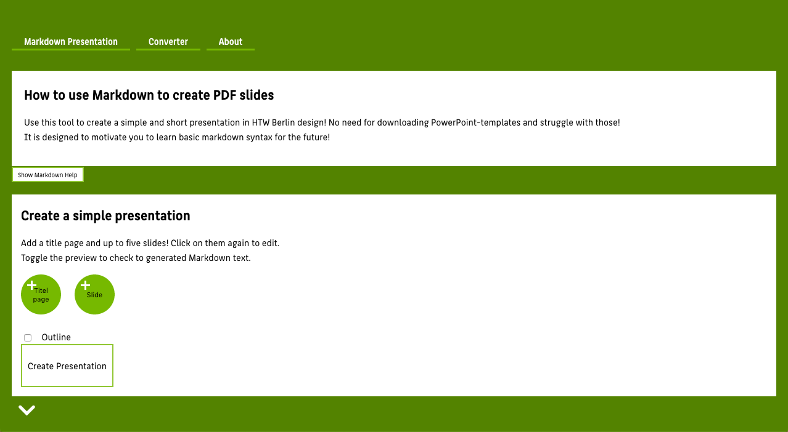 
*Fig. 1: The Presenation-Creation-Tool* 
The tool for creating small presentations aims to give bachelor students of lower semesters an understanding of the basic syntax of [markdown](https://daringfireball.net/projects/markdown/syntax). Instead of just showing or explaining the syntax to the user, the user can create a small PDF presentation using the syntax. The possible scope of the presentations, which can be created using this tool, is suitable for AWE-courses or to illustrate achieved exercises as part of different courses.

### Conversion with corporate design
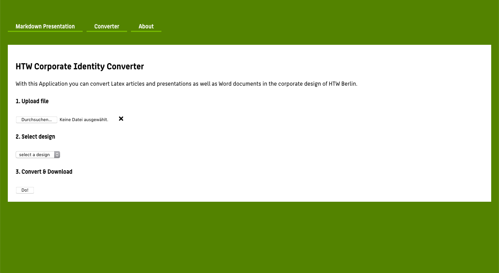 
*Fig. 2: The Conversion-Tool* 
The conversion tool is based on the idea to provide a possibility for professors or lecture speaker to use their default presentations slides or scripts at different universities directly in the corporate design of the university. So far only a conversion to the HTW Berlin corporate design is possible.

## Create Presentations using markdown

### Try the markdown syntax
Click on the ***Show Markdown Help*** button to try markdown yourself. The opened view provides an editor box and the live output of the rendered markdown to track the changes. 
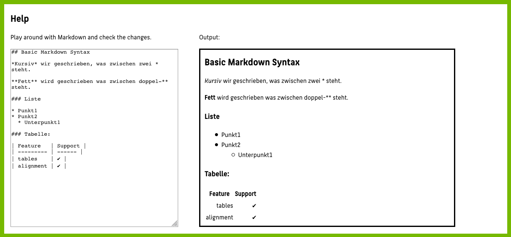 
*Fig. 3: The Try-Yourself-Markdown-Help-Box* 

### Step-by-Step to the presentation

#### 1. Title Slide
The title slide will be the first slide in the presentation. It contains a *title*, a *subtitle*, the *author* and the *date*, which all can be set. The *title*, *author* and *date* are shown on all slides (beside the title slide) in the footer. 
##### Create
To create a title slide click on the green, round button **Title page**. This will show input fields for the mentioned contents. After setting them one can save (check-mark), cancel (cross) or delete (bin) the title page.  
 &rarr; 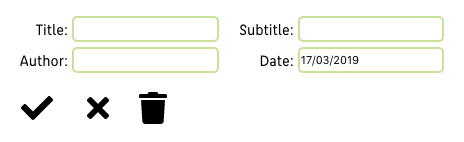 
*Fig. 4: Create a title page* 
##### Edit
Canceling or deleting makes more sense if one is editing the slide. To edit the title slide (after saving it for the first time) click on the green, round button **title** and the input fields with the set contents will be shown. 
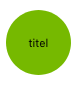 &rarr; 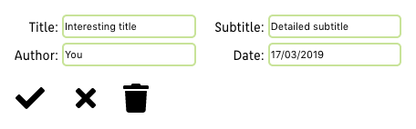 
*Fig. 5: Edit/delete a title page* 
#### 2. Slides
One can create up to five slides, which will be shown in the order in which they've been created. A slide has a *title* and *content* (the *content* can be split into two vertical columns). 
The *content* is where markdown syntax can be used. The user can create lists, tables and use italic/bold font. A possibility to add an image per url is provided as well.
##### Create a slide
To create a new slide click on the green, round button **Slide**. This will show the slide editor.   
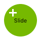 &rarr; 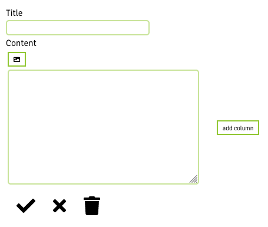 
*Fig. 6: Create a regular slide*  
For each created slide a button with the index of the slide will be added:
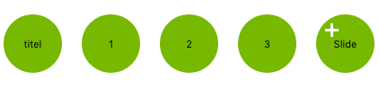 
*Fig. 7: Buttons to edit the created slides* 
##### Edit a slide
To edit a certain slide click on the green, round button with the number of the slide you want to edit. This will again show the slide editor, but with filled fields.   
 &rarr; 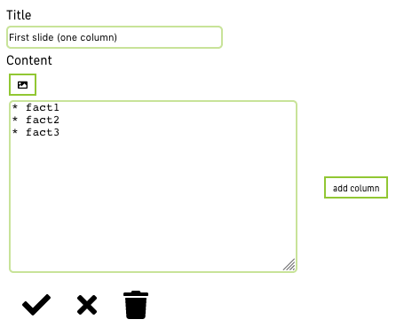 
*Fig. 8: Edit a regular slide*  
##### Slide editor
In the slide editor the user can set a *title* and edit the *content* of the slide:
* enter markdown syntax for lists, tables or bold/italic font
* click on the **add column** button to add an edit-field for the second column (can be removed with **remove column** button)
* click on the small image icon to add an url to an image, which will be shown on the slide (resp. in one column of the slide) 

After creating/editing the slide one can save (check-mark), cancel (cross) or delete (bin) the slide. 
The slides should not be overfilled with content, e.g. put images on separate slides or at least in the second column.
###### Add a column
 &rarr; 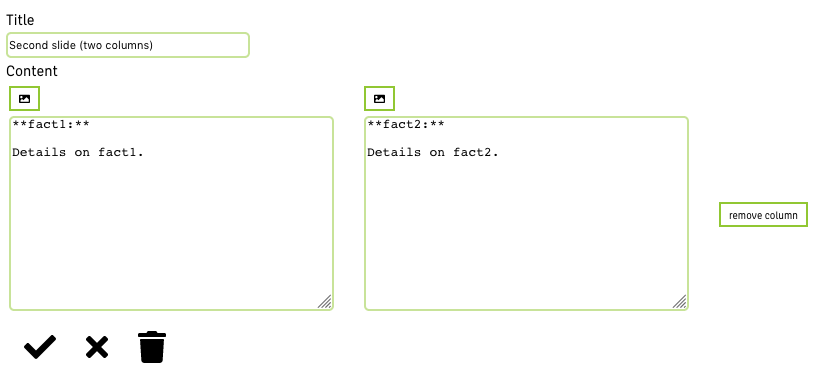 
*Fig. 9: Add a column (and content)*  
###### Add an image
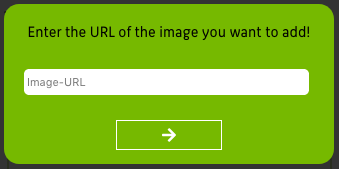 &rarr; 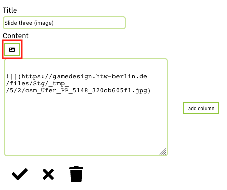 
*Fig. 10: Add an image*  
#### Create the presentation
To create and download the presentation, the **Create Presentation** button has to be clicked. Optionally an outline slide (on second position) can be included.
##### Markdown-Preview
To help the understanding of markdown syntax in order to create a presentation, the user can preview the created markdown before converting to PDF-slides. Therefore the user has to click on the small white arrow at the bottom of the page: 
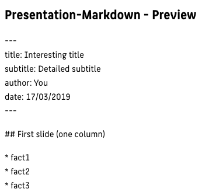 
*Fig. 11: Markdown-Preview*  

### Example outputs
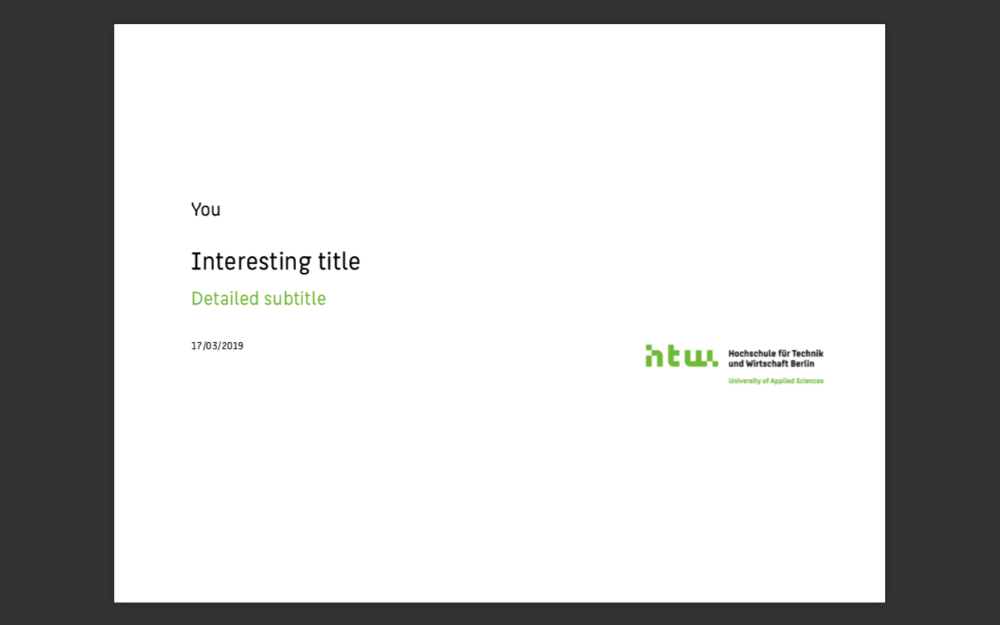 
*Fig. 12: Titlepage example*  
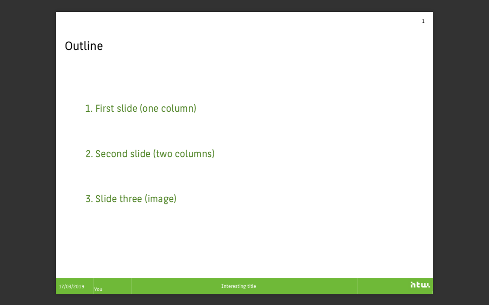 
*Fig. 13: Example for creating the outline slide*  
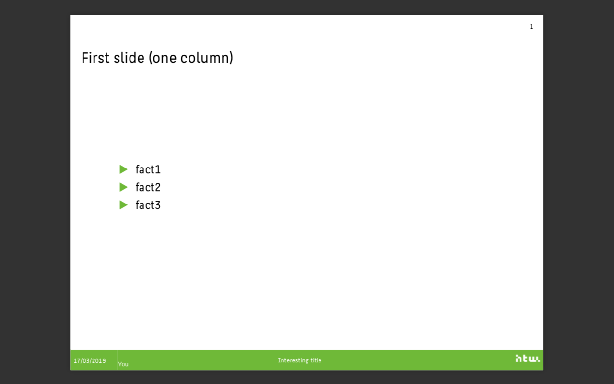 
*Fig. 14: Example for creating a slide with on column*  
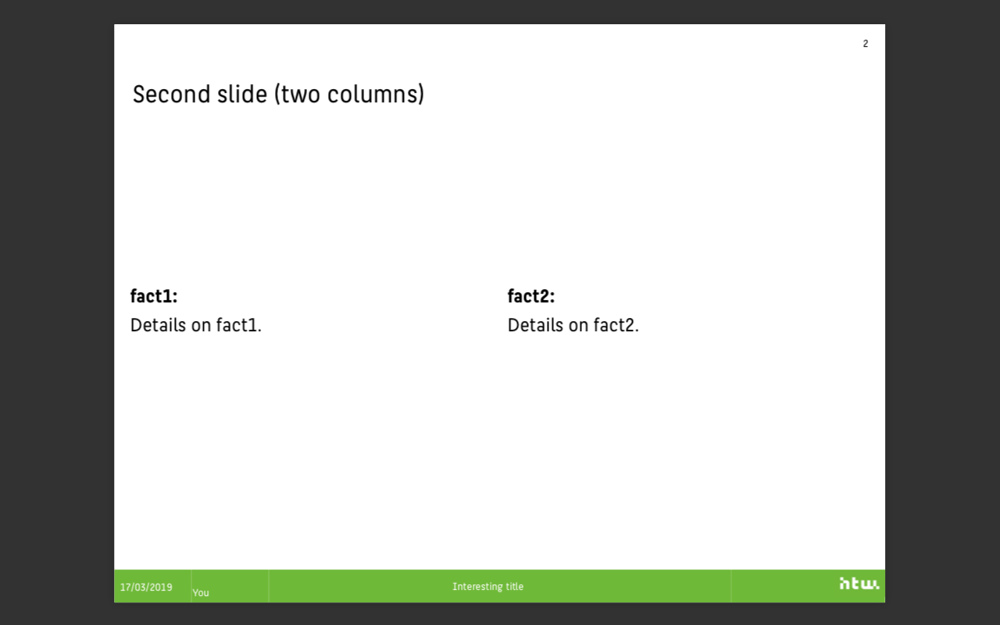 
*Fig. 15: Example for creating a slide with two columns*  
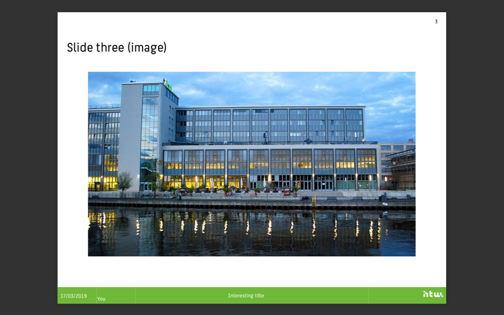 
*Fig. 16: Example for creating a slide with an image*  
 
*Fig. 17: The last slide (added by default)*  
